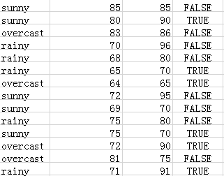
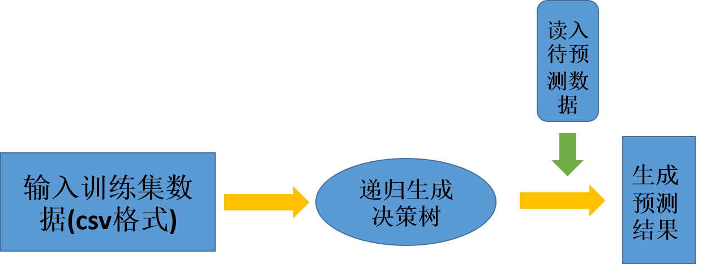

# MachineLearning-DecisionTree
MachineLearning-DecisionTree Algorithm realized by C++ 
## DecisionTree说明文档
```
class DedisionTree
{
public:
        struct Attr    //每一列的属性
        {
            int colIndex;
            string Attribute;
            int typeNum;   //属性取值的个数
            vector<string> AttributeValue;
            map<string, unsigned char>  typeMap; //属性取值对应的整数值;
        };
        struct TreeNode
        {   //节点信息
            string Attribute;   //此节点对应的属性
            bool LeafNode; //如果是叶子节点，此值反映分类结果。 //其他情况都是0;
            vector<TreeNode*> children; //孩子节点的地址。
            map<string, TreeNode*> AttributeLinkChildren;  
            //属性指向孩子节点，也就是对应的树形结构中的树枝
        };     
       //attributes
        cv::Mat trainDataMat;
        vector<vector<string>> predictedDataMat;
        //MatInfo trainMatrixInfo;
        TreeNode *root;  //根节点
        vector<Attr> vectorAttr; //存储所有的矩阵信息，但不存储矩阵。

        //functions
        DecisionTree();    //默认构造函数
        int ReadTrainDataFile(string fileAddress);  //数据预处理
        TreeNode* BuildTree(cv::Mat &data, vector<Attr> &dataAttr, string AlgorithmName); 
        // 指定是哪种算法
        vector<vector<string>> ReadPredictedDataFile(string fileAddreess);
        vector<string> Predicted(TreeNode* root, vector<vector<string>> &pData);  
        //返回值为int类型表示数据的分类。
        ～DecisionTree();
}
```
**TreeNode**
TreeNode 结构体用来存储树的节点信息， Attribute 是std::string类型的数据用来存储当前节点的属性名称，如果该节点是中间节点(分支节点)，那么该值就是对应的属性名称，如果该节点是叶子节点，那么该值就是对应的分类结果。
** Attr **
Attr 结构体用来存储每一种属性的信息，包括这种属性有多少种不同的离散值,如下表所示表示根据不同的信息得出是否去打高尔夫的简单数据，以第一列数据为例，第一列表示天气属性，那么这一列信息对应着一个Attr结构，Attribute在这里的值就是Outlook，LeafNode及是标志，是否为叶子节点，如果是叶子节点，那么Attr存储的是最后一行分类的某个结果，比如说yes，children存储的是孩子节点的地址，AttributeLinkChildren存储的是孩子节点和属性值的映射关系，仍然以第一列数据为例，如果Outlook的结果是sunny那么此时指向sunny对应的叶子节点的地址。


**trainDataMat**
 cv::Mat trainDataMat 存储训练集的数据，此结构由函数ReadTrainDataFile()生成

**predictedDataMat**
vector<vector<string>> predictedDataMat 存储的是待预测的数据矩阵，此矩阵由vector<vector<string>> ReadPredictedDataFile()函数生成

**root**
TreeNode *root 该属性存储决策树的根节点地址

**vectorAttr**
vector<Attr> vectorAttr; 存储所有的属性信息

**DecisionTree()** 默认构造函数

**ReadTrainDataFile()**
int ReadTrainDataFile(string fileAddress) 
此函数执行读取训练数据的功能，输入值为待训练的数据集的地址，数据集的文件要求是必须为csv文件，关于csv文件参考[百度百科](https://baike.baidu.com/item/CSV/10739?fr=aladdin) 并且第一行的属性名称行是不能省略的，如下图的红色部分。此函数内部运行结束直接生成trainDataMat和vectorAttr个数据，这两个数据在后面的操作中非常重要。


**BuildTree()**
TreeNode* BuildTree(cv::Mat &data, vector<Attr> &dataAttr, string AlgorithmName)
此函数用于生成决策树，函数的返回值是决策树根节点的地址，需要将此值返回给root属性，留给后面的预测时使用。
* data 是训练集数据，类型为OpenCV中的Mat类型，对应类中的trainDataMat
* dataAttr 是训练数据的属性信息，对应类中的vectorAttr
* AlgorithmName 是需要指定的决策树划分节点属性类型的方法，这个类中只支持ID3、C4_5、和Gini这三种方法。

**ReadPredictedDataFile()**
vector<vector<string>> ReadPredictedDataFile(string fileAddreess); 
此函数执行读取待预测数据信息的功能，函数输入为待预测的数据，输出为字符串格式的矩阵。同样该文件是csv文件格式，但和ReadTrainDataFile有所差别就是该数据集不需要第一行的属性信息，如果有第一行的属性信息程序可能会出错，同时也不需要最后一列的标签列，对应的该矩阵的列数一定比训练矩阵的列数少1，行数没有限制。此函数输入的文件格式如下图, 


**Predicted()**
 vector<string> Predicted(TreeNode* root, vector<vector<string>> &pData)
 此函数执行预测的功能,函数的输入参数包括根节点地址root和预测数据矩阵pData。

 ##Example
 下面是简单的应用举例
 ### 输入数据说明
 该类的两次输入分别是训练集和预测的测试集，并且都是csv格式的文件，此外目前算法只支持离散数据的分类，对于连续性数据不能使用，且每一列的属性个数不得多于255种，这是因为在程序设计中，每一列的数据个数的这个属性是采用uchar数据类型，所以不能多于255种，当然我们也可以根据自己的实际情况进行更改。程序的执行流程如下图所示
 

```
    da::DecisionTree myDecisionTree; 
    //对训练数据进行操作
    myDecisionTree.ReadTrainDataFile("data.csv");  
    //构建决策树
    myDecisionTree.root = myDecisionTree.BuildTree(myDecisionTree.trainDataMat, myDecisionTree.vectorAttr, "ID3");
    //
    vector<string> result;
    vector<vector<string>> predictedData;
    //对带预测数据进行操作
    predictedData = myDecisionTree.ReadPredictedDataFile("pre.csv");
    //预测
    result = myDecisionTree.Predicted(myDecisionTree.root, predictedData);
```
在最后一步的预测中也可以不额外开辟 predictedData数据，因为在ReadPredictedDataFile()函数执行过程中已经备份一份数据到对象的predictedDataMat属性中，所以按照下面的方法会节省空间和时间
``result = myDecisionTree.Predicted(myDecisionTree.root, myDecisionTree.predictedDataMat);``直接调用对象中的数据即可。

**～DecisionTree()**
 ～DecisionTree() 为构析函数